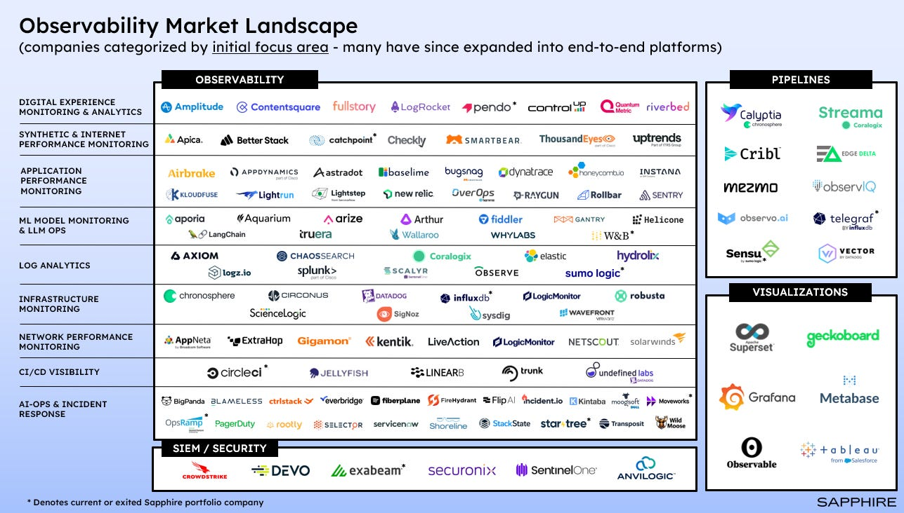
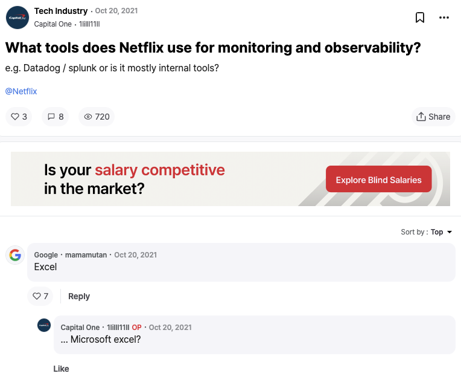

# 1. Observability Market Landscape


<br/>
참고: 그래프 속 기업은 초기 집중 영역별로 분류되어 있으며, 현재는 많은 기업이 초기 분야 뿐만 아니라 여러 분야에 걸쳐 통합 서비스를 제공하고 있다.

<br/>
Observability 실습을 하고 실제 모니터링이 어떻게 이루어지는지 알아보고자 하는데, 그 전에 카테고리에 따라 어떻게 툴이 있는지 간단하게 살펴보고자 한다. 

### 🔹 Metrics
- **Prometheus**: 시계열(time-series) 데이터를 수집하고 저장하는 오픈소스 모니터링 시스템. Kubernetes 환경에서 가장 널리 사용되며, PromQL이라는 쿼리 언어로 유연한 질의가 가능하다.
- **Grafana**: Prometheus와 같은 데이터 소스를 시각화하는 데 사용되는 대시보드 툴. 다양한 플러그인을 통해 메트릭 외에도 로그, 트레이스를 함께 통합해 볼 수 있다. 
    - DataDog(다만 얘는 SaaS라서 직접 구성에 제한이 있음)과 함께 요즘 대세 !! (Metrics + Logs + Traces를 한 화면에서 연결해서 볼 수 있기 때문에 사람들이 많이 사용함)

### 🔹 Logs
- **ELK Stack:**
    - Elasticsearch: 로그 데이터를 색인하고 검색하는 역할
    - Logstash: 다양한 소스에서 로그를 수집하고 가공
    - Kibana: 로그 데이터를 시각화하는 대시보드로, 전통적으로 가장 많이 사용되는 로그 스택이지만, 설치 및 운영이 다소 무거운 편이다.
- **Loki**: Grafana에서 개발한 로그 수집 시스템으로, Prometheus처럼 label 기반 쿼리를 지원한다. 구조가 간단하고 Grafana와의 연동이 뛰어나며, 비교적 가볍게 사용할 수 있다.

### 🔹 Traces
- **Jaeger**: CNCF에서 호스팅하는 분산 트레이싱 시스템. 마이크로서비스 환경에서 요청 흐름을 시각적으로 추적하고 병목 지점을 파악하는 데 유용하다.
- **OpenTelemetry**: Metrics, Logs, Traces 모두를 다루는 오픈소스 Observability 표준. 다양한 언어와 백엔드와 연동이 가능하며, Jaeger, Prometheus 등과 통합하여 사용할 수 있다.

<br/>
일반적인 서비스는 세 가지 카테고리의 툴들을 하나씩, 총 3개의 툴을 이용해서 구현한다. 그 이유는 각각이 맡는 역할이 명확하기 때문인데, 사실 현대는 많은 서비스들이 통합 플랫폼으로 거듭났기 때문에 1-2개의 서비스로도 운영이 가능하다.

<br/>

> 기본적으로 각 카테고리의 역할은 아래와 같다 :
> - Metrics: 빠른 이상 감지
>   - CPU, Memory, Request 수 등의 수치 기반 데이터
>   - 빠르게 “무슨 일이 일어나고 있는지” 파악 가능
>   - 예: “트래픽이 급증했다”, “에러율이 높아졌다”
> - Logs: 상세 원인 파악
>   - 에러 메시지, 디버깅 정보 등 텍스트 기반 기록
>   - Metrics로 감지된 이상을 깊게 파고들 때 필요
>   - 예: “에러 코드 500의 정확한 스택 트레이스를 보고 싶다”
> - Traces: 요청 흐름 분석
>   - 마이크로서비스 환경에서 요청이 어떻게 흐르는지 시각적으로 추적
>   - 병목 구간, 실패 지점을 한눈에 파악
>   - 예: “요청이 어디서 지연됐는지 알고 싶다”

<br/>
🔽 같이 사용하는 구조 예시 (Kubernetes 기준)

```
사용자 요청
   ↓
[Ingress/Service]
   ↓
[Microservice A] --┬→ Metrics (Prometheus)
                   ├→ Logs (Loki or ELK)
                   └→ Trace (Jaeger via OpenTelemetry)
```

각 툴 별로 실습을 하며 자세하게 공부를 할 예정이며, 별개의 포스팅으로 하나씩 올릴 예정이다.


<br/>

# 2. Observability Usecase (실제 기업 사례)
### 🔸 Netflix

( 넷플릭스 구조 관련해서 찾아보다 발견한 글 -- 유머 한 스푼 두고 갑니다 .. ㅎㅎ)
<br/>
<br/>

넷플릭스는 자체적인 플랫폼을 많이 사용해 초기에 공부하기에 적합하다고 생각하지 않았다. 따라서 간단하게만 정리하고 넘어간다.
- 수백 개의 마이크로서비스를 운영
- 자체 Observability 플랫폼을 사용해 메트릭, 로그, 트레이스를 통합 관리
    - Atlas: 시계열 데이터 수집 및 시각화 도구 (Metrics)
    - Vector: 로그 수집 파이프라인
    - Edda: 클라우드 리소스 상태 추적
    - Titus: 컨테이너 관리와 연동된 모니터링
    - Kayenta: 자동화된 카나리 분석 도구
    - Spinnaker: CI/CD 파이프라인 통합
- 장애 복원력(Resilience)을 높이기 위해 Observability에 큰 투자를 함

### 🔸 Pinterest
넷플릭스는 자체적인 플랫폼을 사용하는 반면, 핀터레스트의 경우에는 오픈 소스를 많이 사용하고 있고 클라우드 네이티브 환경에서 Observability를 구축했기 때문에 공부하기에 훨씬 좋다고 판단했다.

- 핀터레스트의 observability 구성은 아래와 같다 :
    - Prometheus + Thanos: 메트릭 수집 및 장기 저장
    - Grafana: 시각화 및 대시보드
    - ELK Stack (Elasticsearch, Logstash, Kibana): 로그 분석
    - Jaeger: 분산 트레이싱
    - OpenTelemetry: 통합 수집기
- 장애 발생 시, 트레이스 기반 분석으로 병목 구간 신속 파악가능


### 🔸 쿠팡
- 실시간 알림 시스템과 로그 분석 도구를 통해 배송 상태 트래킹, 에러 대응 자동화


<br/>

---
출처
- https://casber.substack.com/p/observability-in-2024
- https://netflixtechblog.com/tagged/observability
- 

